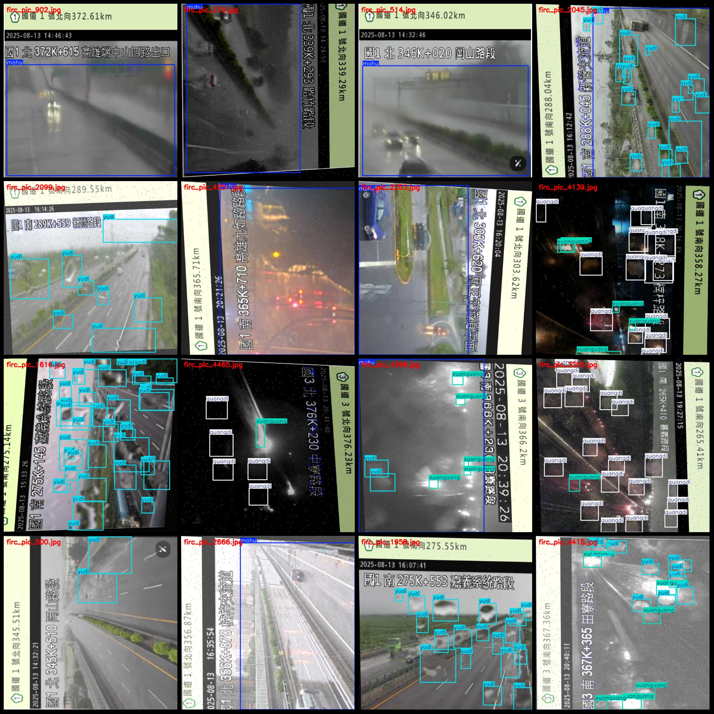
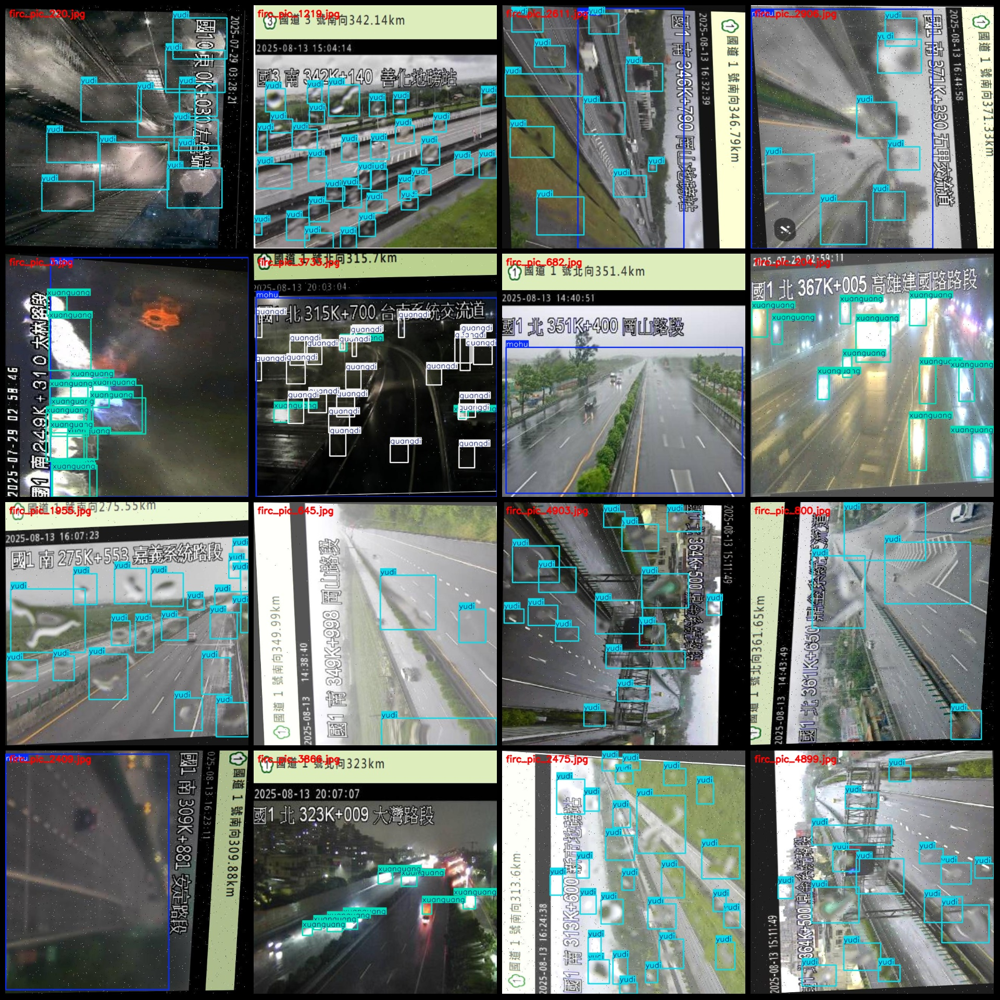

# Rainy High-Speed Road Light Intensity Raindrop Detection Dataset VOC+YOLO Format with 6055 Images in 4 Categories with Enhanced Features

Please note that the dataset contains a large number of enhanced images, with only over 1000 being original images. The remaining are all enhanced images with added noise and rotated. The format of the dataset is Pascal VOC format plus YOLO format (the txt file does not contain the split path, but it only contains the jpg images and corresponding VOC format xml files and yolo format txt files).

number of images: 6055
annotation count: 6055
annotation count: 6055
annotationnumber of classes: 4
Annotation class names: ["guangdi", "mohu", "xuanguang", "yudi"]
[Glow Drop, Blurry, Glitz, Raindrop]
boxes per class: 
guangdi box count = 12994
mohu box count = 2556
xuanguang box count = 10807
yudi box count = 41691
total boxes: 68048
images per class: 
guangdi images = 739
mohu images = 2402
xuanguang images = 2258
yudi images = 3357
image resolution: 640x640
Use annotation tool: labelImg
Annotation rules: Draw a rectangle around the class.
Important notes: The dataset does not have separate training, validation, and test sets; you need to partition it yourself.
Special statement: This dataset does not guarantee the accuracy of the trained models or weight files.
Image preview:
## Images

Here is a pay link on Stripe ( https://buy.stripe.com/3cs8yP7sY87d0vu9AB ). Please contact me lonlonago@foxmail.com after funding $89, and I will send you a complete data files , thank you!

